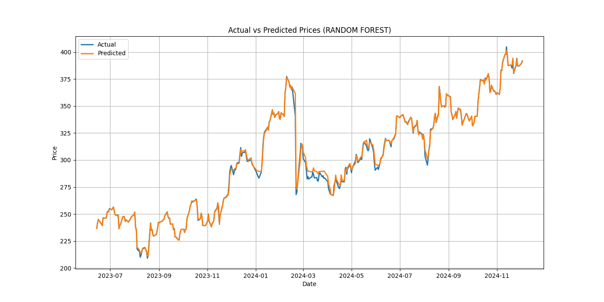
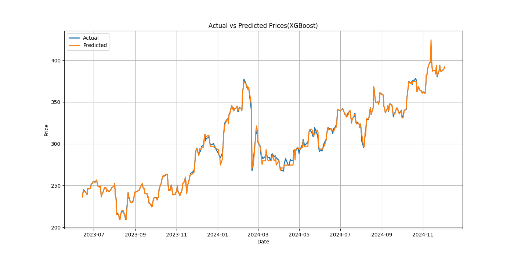
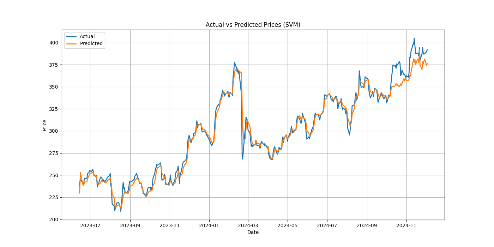
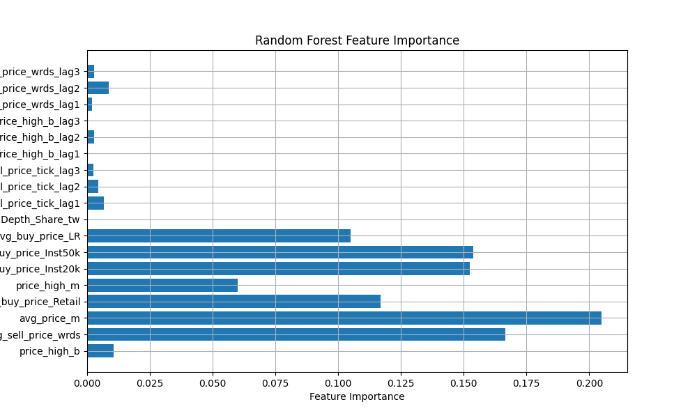

# Stock Prediction Models

> Comparing ML-based price prediction and trading strategies on PANW (Palo Alto Networks) — Random Forest, XGBoost, SVM, against GARCH and Kalman Filter benchmarks. Graduate quantitative finance course project (team of 3).

## What's in here

A side-by-side study of how well classical ML and time-series methods predict daily stock prices, and whether those predictions translate into profitable trading. We picked PANW as the focus ticker, pulled four years of daily data (2020–2024), built 25+ features from market microstructure data, selected the best with LASSO, trained three ML models, and benchmarked everything against Buy-and-Hold.

The headline finding, which I think is the most honest result in the project: **none of the trading strategies beat passive buy-and-hold over the test period.** Random Forest came closest before drifting; the RSI-based long-short strategy ended at -9% total return while buy-and-hold returned +687%. We document this rather than tune our way around it.

## My role

This was a 3-person team. My contributions:

- Built the **Random Forest**, **XGBoost**, and **SVM** prediction models
- Designed the **backtesting framework** comparing day-trading vs. buy-and-hold
- Contributed to **LASSO feature selection** (180 raw features → 25 → top 10)
- Worked with teammates on the **GARCH** and **Kalman Filter** benchmarks

## Approach

1. **Data:** WRDS market microstructure data (180+ price features) + FAMA-French + FRED macro indicators (20 features), 2020–2024.
2. **Feature selection:** LASSO regression to shrink to a manageable feature set — 25 features from the price data, plus SP500 and BTC/USD selected from the macro set as the strongest cross-asset signals.
3. **Models:** Three supervised ML approaches (Random Forest, XGBoost, SVM) trained on rolling 60-day windows to predict next-day adjusted close. Two time-series benchmarks (GARCH, Kalman Filter) to compare against classical methods.
4. **Backtesting:** Each prediction generates a buy/sell signal; we track P&L against a buy-and-hold baseline.
5. **Trading strategies:** Three alternative strategies (Buy-and-Hold, RSI-based Long-Short, Bollinger Band Day-Trade) evaluated 2018–2024.

## Results

**Prediction accuracy** (test set MAE on daily close):
| Model | MAE |
|---|---|
| Random Forest | $1.24 |
| XGBoost | $1.45 |
| SVM | $4.96 |
| Kalman Filter (RMSE) | $4.78 |

**Trading strategies** (cumulative return, 2018–2024):
| Strategy | Total Return | Max Drawdown |
|---|---|---|
| Buy-and-Hold | +687% | -48% |
| Day-Trade (Bollinger Bands) | +9.5% | — |
| Long-Short (RSI) | -9% | — |

## Visuals

| Random Forest predictions | XGBoost predictions | SVM predictions |
|---|---|---|
|  |  |  |

**Random Forest feature importance:**


## Files

| File | Contents |
|---|---|
| `PANW_RandomForest.ipynb` | Random Forest model + feature importance analysis |
| `PANW_BackTesting.ipynb` | XGBoost model + backtesting framework (RF vs. Buy-and-Hold) |
| `PANW_CandleStickChart.ipynb` | SVM model + technical visualization |
| `GARCH.ipynb` | GARCH volatility benchmark |
| `Kalman_Filter.ipynb` | Kalman Filter price prediction benchmark |
| `selected_price_features.csv` | LASSO-selected feature set (output of feature selection step) |

## Reproducing

```bash
git clone https://github.com/kms-kalyan/stock-prediction-models.git
cd stock-prediction-models
pip install -r requirements.txt
jupyter notebook
```

**Dependencies:** `pandas`, `numpy`, `scikit-learn`, `xgboost`, `arch` (GARCH), `yfinance`, `matplotlib`, `scipy`.

## Honest limitations

- **No walk-forward retraining at scale.** Models were trained on rolling windows but not re-tuned per window.
- **No transaction costs in backtests.** Real trading would erode the marginal gains of the Day-Trade strategy further.
- **Single ticker.** PANW was the focus; results may not generalize.
- **Limited hyperparameter search.** Defaults + light tuning rather than a full Bayesian or grid search.

## Data attribution

Market microstructure features sourced from WRDS (Wharton Research Data Services) under academic license. Macro features from Kenneth French's data library and FRED. Adjusted closing prices from Yahoo Finance via `yfinance`.

---

*Built as a final project for a graduate quantitative finance course at Northeastern University.*
